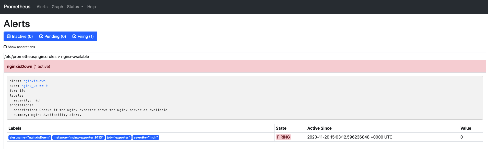
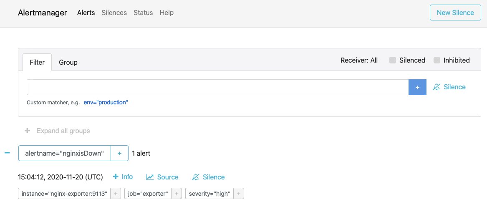
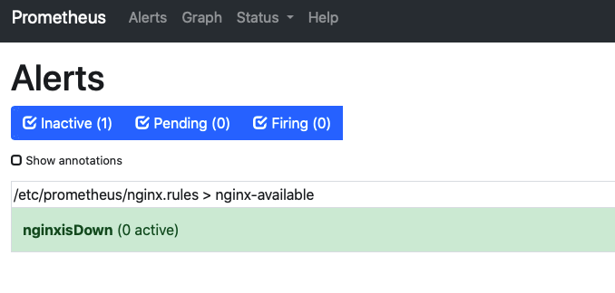
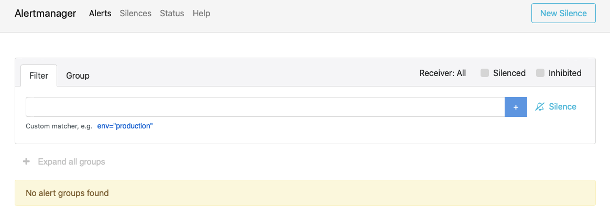

# Nginx-Prometheus-Alertmanager

## Workflow:
Nginx -> Nginx-Exporter -> Prometheus -> Alert Manager

This Docker compose file starts Nginx, Nginx-exporter, Prometheus server and Alert manager. Nginx server is continuously monitored by Prometheus using the metrics from nginx-exporter and send alert notificatiob to alert Manager when the status of the Nginx is changed.

## Setup:

### Pre-requisites:

- [Docker](https://www.docker.com/get-started) installed in the local system. 

### Installation:

Clone the git repository

```sh
$ git clone https://github.com/MaheshKommi/Nginx-Prometheus-Alertmanager.git
$ cd Nginx-Prometheus-Alertmanager
```
Start the Containers using docker-compose

```sh
$ docker-compose up -d
```
Check the status of the containers

```sh
$ docker-compose ps

Name                         Command               State           Ports         
-------------------------------------------------------------------------------------------
alertmanager-server         /bin/alertmanager --config ...   Up      0.0.0.0:9093->9093/tcp
nginx-exporter-prometheus   /usr/bin/exporter                Up      0.0.0.0:9113->9113/tcp
nginx-server                /docker-entrypoint.sh ngin ...   Up      0.0.0.0:8080->80/tcp  
prometheus-server           /bin/prometheus --config.f ...   Up      0.0.0.0:9090->9090/tc
```

### Quick reference links:

Nginx webpage: [http://localhost:8080](http://localhost:8080)

Nginx Metrics: [http://localhost:8080/metrics](http://localhost:8080/metrics)

Ngnix-Exporter: [http://localhost:9113](http://localhost:9113)

Prometheus UI: [http://localhost:9090](http://localhost:9090)

Prometheus Alert page: [http://localhost:9090/alerts](http://localhost:9090/alerts)

Prometheus targets page: [http://localhost:9090/targets](http://localhost:9090/targets)

Alert manager UI:   [http://localhost:9093](http://localhost:9093)

## Testing

### Terminate Nginx server Manually

#### Get the Container name

```sh
$ docker-compose ps

  Name                         Command               State           Ports         
-------------------------------------------------------------------------------------------
alertmanager-server         /bin/alertmanager --config ...   Up      0.0.0.0:9093->9093/tcp
nginx-exporter-prometheus   /usr/bin/exporter                Up      0.0.0.0:9113->9113/tcp
nginx-server                /docker-entrypoint.sh ngin ...   Up      0.0.0.0:8080->80/tcp  
prometheus-server           /bin/prometheus --config.f ...   Up      0.0.0.0:9090->9090/tcp
```

```sh
$ docker kill nginx-server
```

#### Check the status of the nginx Container

```sh
$ docker-compose ps

 Name                         Command                State             Ports         
----------------------------------------------------------------------------------------------
alertmanager-server         /bin/alertmanager --config ...   Up         0.0.0.0:9093->9093/tcp
nginx-exporter-prometheus   /usr/bin/exporter                Up         0.0.0.0:9113->9113/tcp
nginx-server                /docker-entrypoint.sh ngin ...   Exit 137                         
prometheus-server           /bin/prometheus --config.f ...   Up         0.0.0.0:9090->9090/tcp
```

#### Check Prometheus for alerts 

Prometheus Alert page: [http://localhost/alerts](http://localhost/alerts)





#### Check Alert manager for alerts 

Alert manager UI:   [http://localhost:9093](http://localhost:9093)





### Start the Ngnix server manually 

```sh
$ docker-compose up -d nginx-server
```
#### Check the status of Nginx Cointainer
 
```sh
$ docker-compose ps
```

#### Check Ngnix server web page

Nginx webpage: [http://localhost:8080](http://localhost:8080)


#### Check Prometheus for alert status

The Nginx server is up, So we wont see active alerts in Prometheus and Alert manager.

Prometheus Alert page: [http://localhost:9090/alerts](http://localhost:9090/alerts)




#### Check Alert manager for alert status

Alert manager UI:   [http://localhost:9093](http://localhost:9093)




 
